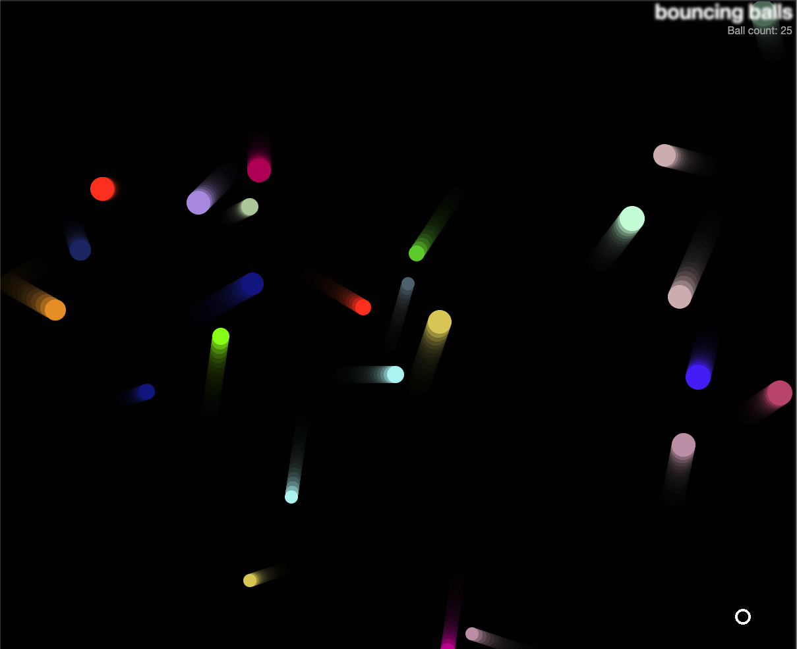

# bouncing-balls

## Instruction
- [Click to play](https://harryghgim.github.io/bouncing-balls)
- Your goal is to eat up all of the moving balls with Evil Circle, which is the circle with  white border.
- Press the following keys to move Evil Circle
    - ⬆️ or `w`
    - ➡️ or `d` 
    - ⬅️ or `a`
    - ⬇️ or `s`

**This project is the result of [Adding features to our Bouncing Balls Demo](https://developer.mozilla.org/en-US/docs/Learn/JavaScript/Objects/Adding_bouncing_balls_features) at [MDN](https://developer.mozilla.org/en-US/).**

